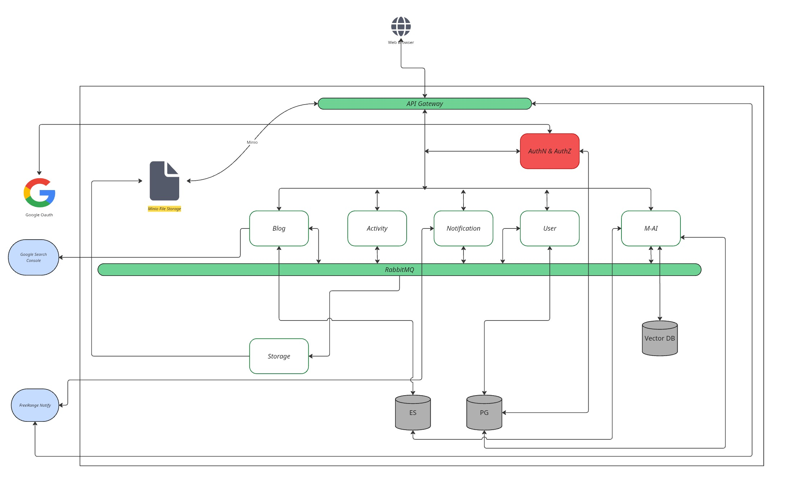

# The Monkeys Engine

**The Monkeys** is an open media and research platform for writers, researchers, and domain experts. It provides a space to publish content, discover knowledge across disciplines, and build on each other's ideas, from science and technology to philosophy, health, and beyond.

The Monkeys Engine is the backend powering this platform: a high-performance microservices system built in Go.

---

## Architecture

The engine follows an **API Gateway + microservices** pattern. All client traffic enters through a single gateway, which handles authentication, routing, and rate limiting. Services communicate synchronously over **gRPC** and asynchronously via **RabbitMQ**.



### Component Overview

| Component | Role | Technology |
|---|---|---|
| **API Gateway** | Entry point — routing, auth, rate limiting, CORS | Go, Gin |
| **AuthN & AuthZ** | Authentication, JWT issuance, access-level enforcement | Go, gRPC |
| **Blog** | Content creation, drafts, publishing, tagging | Go, PostgreSQL |
| **User** | Identity, profiles, account management | Go, PostgreSQL |
| **Activity** | Behaviour tracking, analytics, audit logging | Go, Elasticsearch |
| **Notification** | Push notification dispatch | Go, FreeRange Notify |
| **Storage** | File and media asset management | Go, MinIO |
| **M-AI** | Content recommendations, semantic search | Python, gRPC, Vector DB |
| **RabbitMQ** | Async event bus — cascading deletes, activity events | RabbitMQ |

### External Integrations

- **Google OAuth** — social login
- **Google Search Console** — SEO indexing
- **FreeRange Notify** — push notifications

---

## Technology Stack

| Layer | Technology |
|---|---|
| Language | Go 1.26, Python (AI service) |
| API Gateway | Gin |
| Inter-service RPC | gRPC / Protobuf |
| Async Messaging | RabbitMQ (publisher confirms, DLX/DLQ) |
| Relational DB | PostgreSQL 17 |
| Search & Analytics | Elasticsearch 8 |
| File Storage | MinIO |
| Caching | Redis |
| Logging | Zap (structured, JSON in production) |
| Containerisation | Docker, Docker Compose |
| DB Migrations | golang-migrate |

---

## Repository Structure

```
the_monkeys_engine/
├── microservices/          # One directory per service
│   ├── the_monkeys_gateway/
│   ├── the_monkeys_authz/
│   ├── the_monkeys_blog/
│   ├── the_monkeys_users/
│   ├── the_monkeys_activity/
│   ├── the_monkeys_notification/
│   ├── the_monkeys_storage/
│   ├── the_monkeys_ai/
│   └── the_monkeys_stream/
├── apis/serviceconn/       # Protobuf definitions & generated gRPC stubs
├── schema/                 # PostgreSQL migration files
├── schema_es/              # Elasticsearch index mappings
├── config/                 # Shared configuration helpers
├── logger/                 # Zap logger initialisation
├── rabbitmq/               # RabbitMQ connection manager & publisher
├── static/                 # Static assets (architecture diagram, etc.)
├── docker-compose.yml
└── Makefile
```

Each microservice follows the same internal layout:

```
the_monkeys_<service>/
├── main.go
├── Dockerfile
├── Dockerfile.distroless
└── internal/
    ├── consumer/   # RabbitMQ consumers
    ├── services/   # Business logic / gRPC server implementation
    ├── database/   # DB client initialisation
    └── models/     # Data structs
```

---

## Local Development

### Prerequisites

- [Docker](https://docs.docker.com/get-docker/) and Docker Compose
- [Go 1.26+](https://go.dev/dl/)
- [protoc](https://grpc.io/docs/protoc-installation/) with the Go gRPC plugins (only required if modifying `.proto` files)

### 1. Configure environment

Copy the example environment file and fill in your values:

```bash
cp .env.example .env
```

The key variables are documented inside `.env.example`.

### 2. Start infrastructure services

```bash
docker compose up the_monkeys_db elasticsearch-node1 redis rabbitmq minio -d
```

### 3. Run database migrations

```bash
docker compose run --rm db-migrations up
```

### 4. Start all services

```bash
docker compose up
```

Or start an individual service for development:

```bash
cd microservices/the_monkeys_gateway
go run main.go
```

---

## gRPC & Protobuf

All inter-service contracts are defined under `apis/serviceconn/`. After modifying a `.proto` file, regenerate stubs with:

```bash
make proto
```

---

## Contributing

Contributions are welcome. If something is missing or could be improved, open an issue or a pull request.

Please read the [Contributing Guidelines](contribution/contribution.md) before submitting changes.
